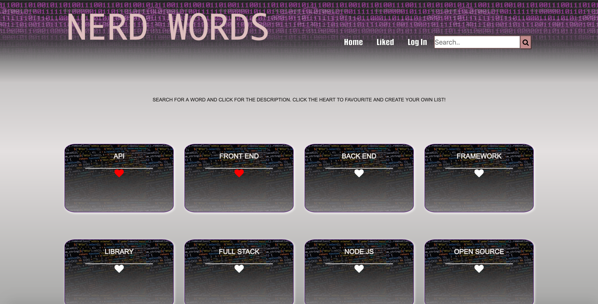

# Nerd Words Back End


This is the back end for a group project built that was built in 5 days during week 12 of the Develop Me Coding Fellowship. Nerd Words is a dictionary app aimed at beginners to coding, which included the ability for users to create a list of 'liked' words. I was responsible for setting up the database and API using Laravel whilst my two coursemates were responsible for building the front end using React and Redux (repo for their work available [here](https://github.com/AlexanderBraatz/final-project-front-end) and live site available [here](https://alexanderbraatz.github.io/final-project-front-end/#/)). I set the API up on a server using AWS, which is available at the following URL: https://nerdwords.developme.space/api/

## Installation
To get set up with the project on your local machine you will need [Vagrant](https://www.vagrantup.com/) downloaded on your machine. Once you've done this, follow these instructions:

1.  Run `git clone git@github.com:LaikaTheSpaceDog/final-project-back-end.git <desired sub-directory>`. The project files will be cloned to your local repo.
2.  Go to your project directory and run `npm install`. This will install the dependencies in the local node_modules folder.
3.  Go to the project folder: `cd final-project-back-end`.
4.  Run `composer install` to download the required dependencies locally.
5.  Run `vendor/bin/homestead make` to copy relevant Homestead files into project directory.
6.  Change the second line of Homestead.yaml so it just uses 512mb: `memory: 512`
7.  Run `cp .env.example .env` to create a .env file
8.  In your newly created .env file, make the following changes:
   ````
   DB_DATABASE=homestead
   DB_USERNAME=root
   DB_PASSWORD=secret
   ````
9. Run `vagrant up` to get Vagrant up and running.
10. Once Vagrant has finished loading, in your browser go to the below to view the UI:
    1.  On Mac: http://homestead.test
    2.  On Windows: http://localhost:8000
11. Run `vagrant ssh` to SSH into the running Vagrant machine.
12. Run `cd code` to enter the code directory.
13. Run `artisan migrate` to run all migrations.
14. _optional_: Run `artisan db:seed` to run the Owners seeder - this will populate the Words table with the words we used in our live site.

## API Routes
Please see below for a list of the API routes that you can use once you have the project set up in your local environment.

1. GET: http://homestead.test/api/words
2. GET: http://homestead.test/api/words/{id}
3. GET: http://homestead.test/api/words/{id}/links
4. GET: http://homestead.test/api/words/liked
5. POST: http://homestead.test/api/words
6. POST: http://homestead.test/api/words/{id}/links
7. PUT: http://homestead.test/api/words/{id}
8. PATCH: http://homestead.test/api/words/{id}
